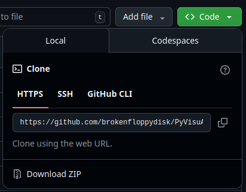

# PyVisuAlign

A lightweight viewer and annotation tool for data produced by VisuAlign. Use PyVisuAlign to open VisuAlign projects, inspect annotations, and add measurements.

For information about VisuAlign, see the [QUINT workflow documentation](https://www.ebrains.eu/tools/quint-workflow).

## Quick start

1. Create and activate a Python virtual environment (recommended):
    - macOS / Linux:
    ```sh
    python3 -m venv .venv
    source .venv/bin/activate
    ```
    - Windows (Powershell):
    ```
    python -m venv .venv
    ./.venv/Scripts/Activate.ps1
    ```

2. Install dependencies:
   ```sh
   pip install -r requirements.txt
   ```

3. Run the application:
   ```sh
   python3 main.py
   ```
   In the app choose "Load VisuAlign JSON File" and select the project's `.json`.


## Installation

Either use Git to clone the repository, or press Code -> Download ZIP on GitHub.



This application requires Python 3 to be installed.

Install the required Python dependencies:

```sh
pip install -r requirements.txt
```

If on Python 3.13 or later, a virtual environment must be created before installing packages.

## Importing Atlas Data

Mouse Brain Atlas data is stored as `.cutlas` files in the `cutlas/` folder. `.cutlas` files should follow the following structure:

```
CUTLAS_NAME.cutlas
    |-- labels.nii.gz
    |-- labels.txt
```

Documentation for the cutlas file format can be found [here](https://www.nitrc.org/plugins/mwiki/index.php?title=quicknii:Cutlas_file_format). 
Cutlas files can be obtained from an installation of QuickNii or VisuAlign.

## Usage

To start the app, run:

```sh
python3 main.py
```

Then select "Load VisuAlign JSON File". Navigate to a VisuAlign project, and select the corresponding `.json` file.

## License

MIT License